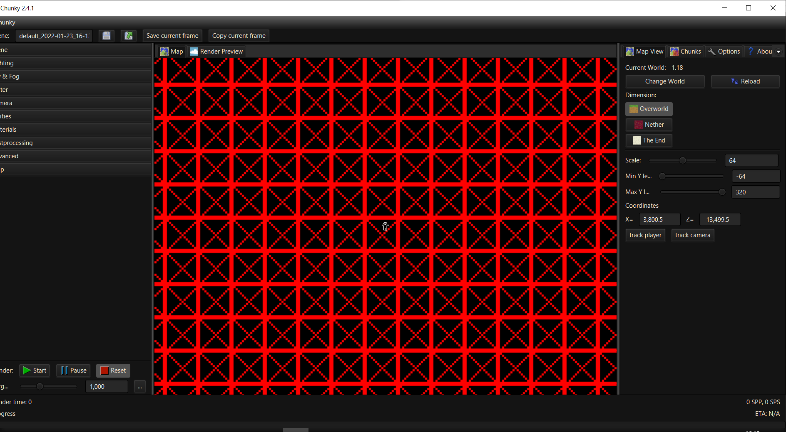

# Troubleshooting Chunky

This page lists some common issues and how to fix them.

---

## Chunky opens as a blank window (Windows)

If the Chunky or Chunky Launcher window is blank when you start it, this is caused by an issue in the JavaFX hardware renderer for Windows. The only known solution is to add `-Dprism.order=sw` to the Java command when starting Chunky. The option needs to be added in the [Java options](../../getting_started/configuration/#java-options) field in the launcher.


## Double clicking ChunkyLauncher.jar doesn't work

A common issue with Java on Windows is that jar files may not be correctly associated with Java.

This can be fixed by either uninstalling and reinstalling Java or through using an application like [Jarfix](https://johann.loefflmann.net/en/software/jarfix/index.html) or through launching the Launcher via commandprompt, ie `java -jar "path\to\chunkylauncher\chunkylauncher.jar"`. Using the latter solution you can create a batch file which is clickable.


## Exception in thread "main" java.lang.NoClassDefFoundError: javafx/stage/Stage

JavaFX is only typically bundled with Oracle Java. On all OpenJDK/OpenJRE's you will need to manually download OpenJFX, extract it, and potentially launch Chunky Launcher and add to the `Java Options` field in the launcher: `--module-path "path\to\javafx\lib" --add-modules javafx.controls,javafx.fxml`[^3].

For Windows we cover this under [Universal JAR - Chunky Launcher](../../getting_started/installing#universal-jar-chunky-launcher)

For Linux try `sudo apt install openjfx`. Should this fail please follow the link above and proceed to download and extract the Linux x64 SDK from GluonHQ like with Windows. Valid locations are `/usr/share/openjfx/lib`, `/usr/lib/jvm/java-<javaVersion>-openjdk`, `.chunky`, or if the extracted folder contains `javafx` though this check is crude.


## Memory Limit won't go above 2Gb

If you are not able to set the memory limit for Chunky greater than 2Gb, despite having more than 2Gb of RAM in your computer, then you need to upgrade to a 64-bit Java installation. A 32-bit Java installation does not allow more than 2Gb for the Chunky memory limit.

If you try launching Chunky with more than 2Gb of memory in a 32-bit Java installation, you will get an error message similar to this:


Check the debug console (enable it under Advanced Settings in the launcher):


The line that says "Could not reserve enough space for ...  object heap" indicates that the Java installation did not allow the configured memory limit.

## Map View Ocean / red X / Unsupported World/Chunks



If you attempt to load an unsupported world in Chunky you may find that `Map View` displays the chunks as either an Ocean biome, if the `Scale` is set below 13, or as red X's. That means the world is not currently supported (in this version of Chunky). It is recommended to try updating Chunky, potentially to `Stable Snapshot` or `Snapshot` via `Release Channels` in the Launcher if the world is from a newer version of Minecraft. Otherwise please refer to the issue tracker or our Discord server.

## Black blocks with a red X / Wrong Textures / Changing Texture Pack

Chunky needs to load textures from a Minecraft installation or a resource pack, otherwise it uses its own built-in textures for the missing texutre.

If you get the wrong textures when you create a 3D scene, there are two things you can do:

* Update the path to your Minecraft installation in the Chunky launcher.

* Load a resource pack that contains the missing textures: [See guide](../../user_interface/chunky_ui/#resource-packs)


## I try to create a new scene but it is empty

First, make sure that you have selected some chunks before creating a new scene.

If you still have the problem it may be caused by the `Y min clip`/`Y max clip` settings. The Y clip settings in the Render Controls pane under Scene can prevent the blocks from being loaded, especially if you are loading a superflat world. All blocks that have a Y value (height) outside the Y clip value will not be loaded.

## java.lang.NoSuchMethodError: javafx.scene.control.ChoiceBox.setOnAction(Ljavafx/event/EventHandler;)

The setOnAction method was added to the ChoiceBox API starting from Java 8 update 60. It is recommended to at least update to 8u60 however 8u300+ would be most secure with Java 17 LTS recommended.

## Rare bugs

The section below is where we will be documenting rarer bugs that typically are not due to Chunky itself but other issues on your system. Given how rare these bugs are we have limited solutions available on how to resolve them.

### Font garbled/broken


Potential fixes:

1) Use a dedicated GPU with java (Semi recommended)

2) Disable cleartype (Not recommended) - Makes all text look ugly but at least not broken

3) Update your graphics card driver (Best fix)

4) Fix (uninstall and reinstall) the Segoe UI font and/or any other broken fonts


### Graphics Device initialization failed for...

```
Graphics Device initialization failed for :  d3d, sw
Error initializing QuantumRenderer: no suitable pipeline found
```

```
Caused by: java.lang.RuntimeException: Error initializing QuantumRenderer: no suitable pipeline found
        at javafx.graphics/com.sun.javafx.tk.quantum.QuantumRenderer$PipelineRunnable.init(QuantumRenderer.java:95)
        at javafx.graphics/com.sun.javafx.tk.quantum.QuantumRenderer$PipelineRunnable.run(QuantumRenderer.java:125)
        ... 1 more
```

Potential causes:

1) Specified module path does not point to a valid javafx sdk

2) Mismatched JDK/JavaFX architectures (ie x86 and x64, aarm64 and x64, etc)

3) Missing GTK2 on Linux

4) Try a differnt JDK like [such as this one](https://jdk.java.net/17/)


### Problematic frame...

```
Problematic frame:
v  ~StubRoutines::SafeFetchN
```

This bug is in the Java issue tracker and will be fixed in 17.0.2. You may need to try a different JDK.


### Module jrt.fs conflict

If you get the following error: `java.lang.LayerInstantiationException: Package jdk.internal.jimage in both module java.base and module jrt.fs`, open `C:\Program Files\openjfx\lib` and delete `jrt-fs.jar`; However this issue typically occurs if you merge OpenJFX's lib folder into your OpenJDK lib folder which you should **NEVER** do. Please install openjfx correctly.


[^3]: Important note that quotation marks `" "` need to be included surrounding any file paths to ensure that special characters like a hyphen, `-`, space, ` `, etc. do not cause issues.


--8<-- "includes/abbreviations.md"
