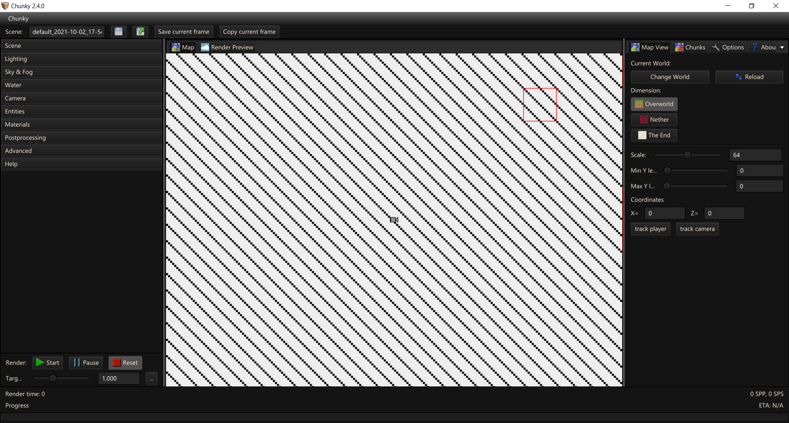
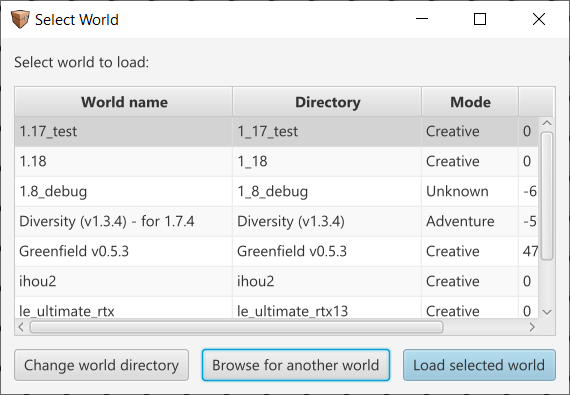

# Your first render from start to finish

## Installation

Please follow the [Installation instructions](../getting_started/installing.md).

---

## Chunky Launcher


Chunky can use a lot of memory depending on a number of factors. Many issues can be caused by Chunky not having enough memory so raising the `Memory limit (MiB)` can solve these issues. The default `1024` can be raised based upon how much memory your system has and is typically available. ie - If your system has 16GiB or 16384MiB of system memory, allocating upto 75% which is 12GiB or 12288MiB is typically fine (you can allocate more but you may run into other problems).

If your `.minecraft` is located in a directory other than where Chunky is expecting you may also need to change this as otherwise Chunky will not have textures.

You should not need to access Advanced Settings.

For now you can close Chunky/Chunky Launcher.

---

## Getting camera position
> This part is for taking an in-game view and rendering it out. Feel free to skip this part if you are more confident!

Open Minecraft and a world you wish to render moving your player to where and what you wish to render, ensuring you are facing the direction too. 


Take note of the fields highlighted in red, we will need these to position the camera correctly within Chunky once converted. You can close your game.

> ie X = 32.2 ; Y = 71.7 ; Z = -232.7 ; Yaw = 67.5 ; Pitch = 8.2 (rounded to 1 DP)

---

## Selecting Chunks

If Chunky isn't running go ahead and launch it. You should see something like this:



Take note that the centeral pane under `Map` is white and black striped and over on the right panel, under `Map View`, `Current World` is blank. This indicates that no world is selected. Click on `Change World` to select or change the world.



Once you have located the world, click on `Load selected world`.


Select the correct dimension using the buttons in the right pane under `Map View` and then select the chunks you wish to render:

- Left click a chunk to select / unselect the chunk
- Shift click + drag to select a rectangular area
- Crtl Shift click + drag to unselect a rectangular area
- Click and drag to pan around the world
- Zoom in and out using the scroll wheel
- Right click to access a few options

> Selecting fewer chunks can decrease rendering time, but they will be completely missing from the render. Try and only select what the camera can see!

---

## Setting up your render
> This part of the process is where you can customise settings to your heart's content. The guide will only cover the absolute basics so it is recommended to experiment.

### Loading Chunks

Either right click the 2D map located in the center pane and click on `New scene from selection` OR over in the left pane (Render Controls) under `Scene` click on `Load selected chunks`.


After loading the selected chunks the centeral pane should auto switch to the Render Preview and the bottom progress bar should be filled. The time it takes to load increases with the number of chunks.

There are a few options under `Scene` you may wish to tweak:

`Canvas size` is the aspect ratio and resolution you want the preview and the final render to be. Higher values take longer to render so using a lower resolution, like 960x540, can massively boost preview/test render performance (and the `X2` button can double both axis up to 1920x1080).

`Save dump once every X` is effectively an auto save feature. Chunky will not render while dumping so do not set this too low unless you believe your system is unstable.

---

Unfortunately you cannot just copy the values taken from the MineCraft F3 menu without a few tweaks first; There are some differences we need to account for. Below you can find a set of conversions:

```
Camera X = mcX
Camera Y = mcY + ~1.5
Camera Z = mcZ

Camera Yaw = -(mcYaw - 90)
Camera Pitch = mcPtich - 90
```

<!-- EOF -->
