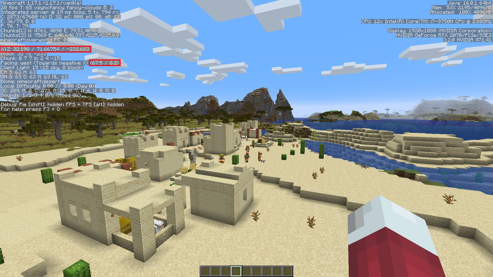

# Your first render from start to finish

## Installation

Follow the [Installation instructions](../getting_started/installing.md).

---

## Chunky Launcher


Chunky can use a lot of memory depending on a number of factors. Many issues can be caused by Chunky not having enough memory so raising the `Memory limit (MiB)` can solve these issues. The default `1024` can be raised based upon how much memory your system has and is typically available. ie - If your system has 16GiB or 16384MiB of system memory, allocating upto 75% which is 12GiB or 12288MiB is typically fine (you can allocate more but you may run into other problems).

If your `.minecraft` is located in a directory other than where Chunky is expecting you may also need to change this as otherwise Chunky will not have textures.

You should not need to access Advanced Settings.

For now you can close Chunky/Chunky Launcher.

---

## Getting camera position
> This part is for taking an in-game view and rendering it out. Feel free to skip this part if you are more confident!

Open Minecraft and a world you wish to render moving your player to where and what you wish to render, ensuring you are facing the direction too. 



Take note of the fields highlighted in red, we will need these to position the camera correctly within Chunky once converted. You can close your game.

> ie X = 32.2 ; Y = 71.7 ; Z = -232.7 ; Yaw = 67.5 ; Pitch = 8.2 (rounded to 1 DP)

---

## Selecting Chunks

---

## Setting up your render

Unfortunately you cannot just copy the values taken from the MineCraft F3 menu without a few tweaks first; There are some differences we need to account for. Below you can find a set of conversions:

```
Camera X = mcX
Camera Y = mcY + ~1.5
Camera Z = mcZ

Camera Yaw = -(mcYaw - 90)
Camera Pitch = mcPtich - 90
```

<!-- EOF -->
