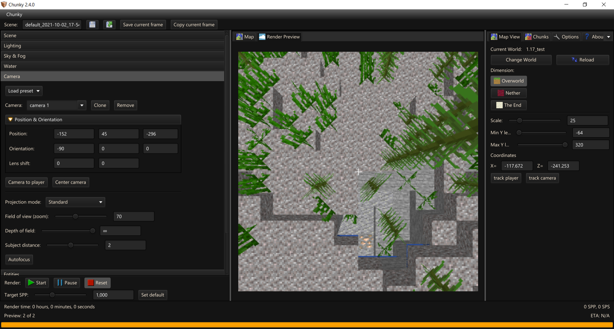
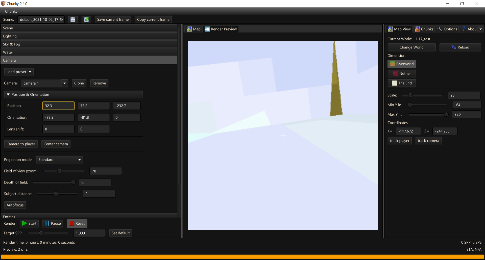
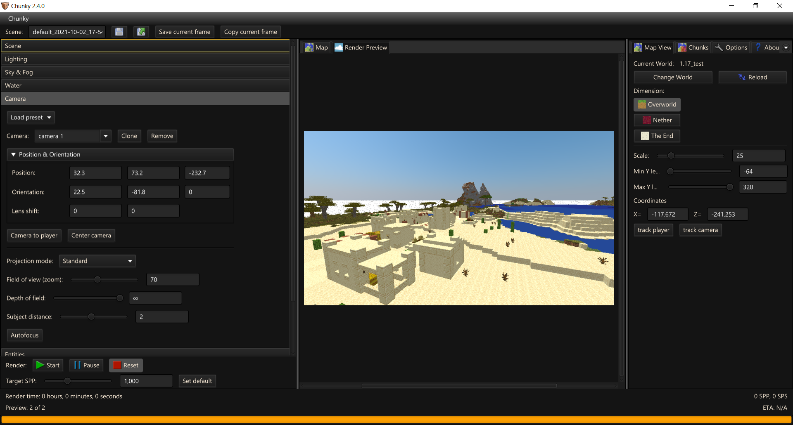
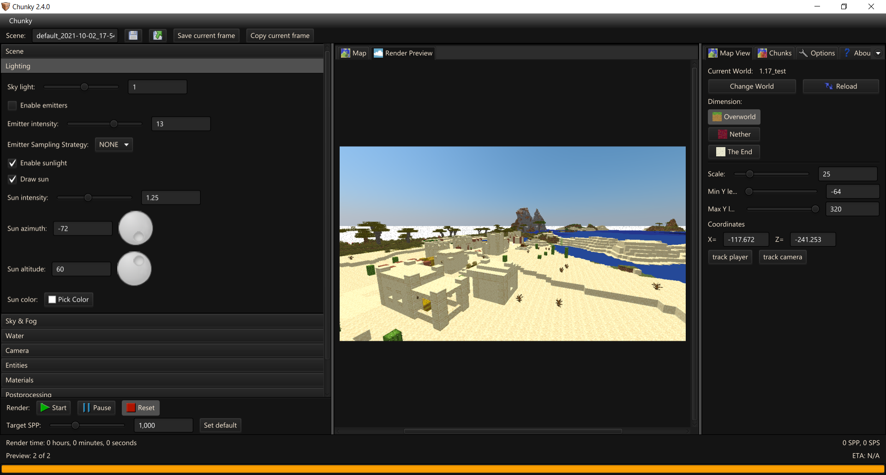
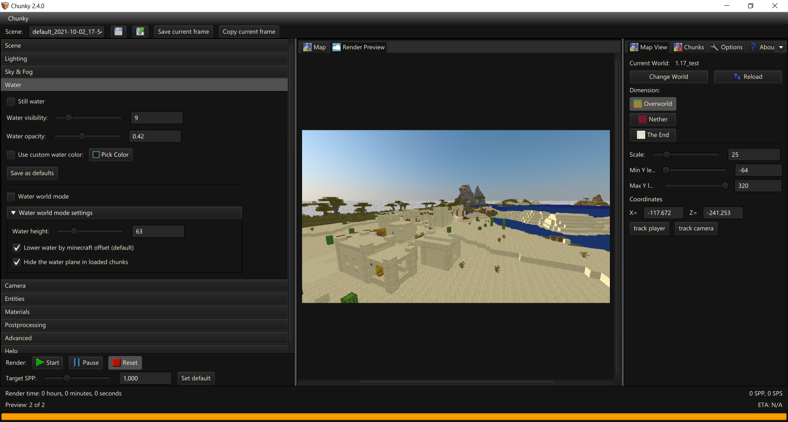
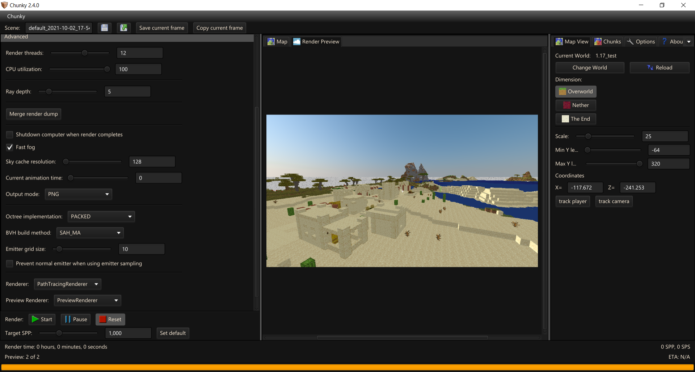
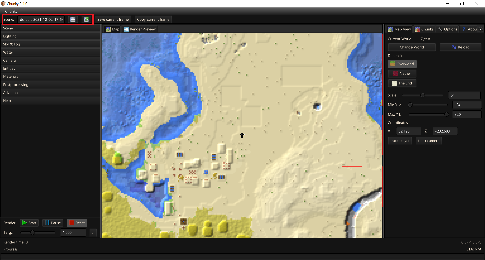
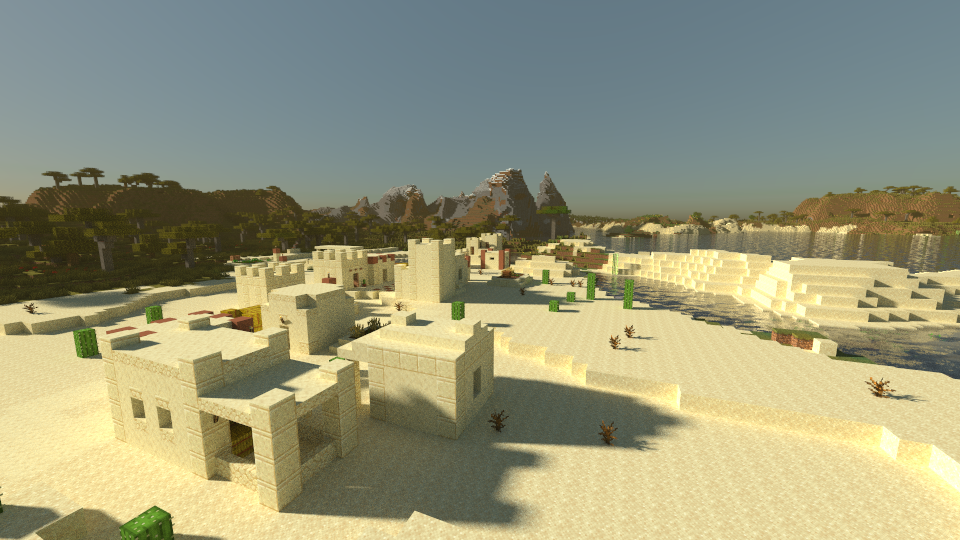

# Your first render from start to finish

---

## Installation

Please follow the [Installation instructions](../getting_started/index.md).

---

## Chunky Launcher


Chunky can use a lot of memory depending on a number of factors. Many issues can be caused by Chunky not having enough memory so raising the `Memory limit (MiB)` can solve these issues. The default `1024` can be raised based upon how much memory your system has and is typically available. ie - If your system has 16GiB or 16384MiB of system memory, allocating upto 75% which is 12GiB or 12288MiB is typically fine (you can allocate more but you may run into other problems).

If your `.minecraft` is located in a directory other than where Chunky is expecting you may also need to change this as otherwise Chunky will not have textures.

You should not need to access Advanced Settings.

For now you can close Chunky/Chunky Launcher.

---

## Getting camera position
> This part is for taking an in-game view and rendering it out. Feel free to skip this part if you are more confident!

Open Minecraft and a world you wish to render moving your player to where and what you wish to render, ensuring you are facing the direction too. 


Take note of the fields highlighted in red, we will need these to position the camera correctly within Chunky once converted. You can close your game.

> ie X = 32.2 ; Y = 71.7 ; Z = -232.7 ; Yaw = 67.5 ; Pitch = 8.2 (rounded to 1 DP)

---

## Selecting Chunks

If Chunky isn't running go ahead and launch it. You should see something like this:


Take note that the centeral pane under `Map` is white and black striped and over on the right panel, under `Map View`, `Current World` is blank. This indicates that no world is selected. Click on `Change World` to select or change the world.


Once you have located the world, click on `Load selected world`.


Select the correct dimension using the buttons in the right pane under `Map View` and then select the chunks you wish to render:

- `Left click` a chunk to select / unselect the chunk
- `Shift` `click` + drag to select a rectangular area
- `Ctrl` `Shift` `click` + drag to unselect a rectangular area
- `Click` and drag to pan around the world
- Zoom in and out using the `scroll wheel`
- `Right click` to access a few options

> Selecting fewer chunks can decrease rendering time, but they will be completely missing from the render. Try and only select what the camera can see!

---

## Setting up your render
> This part of the process is where you can customise settings to your heart's content. The guide will only cover the absolute basics so it is recommended to experiment.

### Loading Chunks

Either right click the 2D map located in the center pane and click on `New scene from selection` OR over in the left pane (Render Controls) under `Scene` click on `Load selected chunks`.


After loading the selected chunks the centeral pane should auto switch to the Render Preview and the bottom progress bar should be filled. The time it takes to load increases with the number of chunks.

### A few settings to change...

There are a few options under `Scene` you may wish to tweak:

`Canvas size` is the aspect ratio and resolution you want the preview and the final render to be. Higher values take longer to render so using a lower resolution, like 960x540, can massively boost preview/test render performance (and the `X2` button can double both axis up to 1920x1080).

`Save dump once every X` is effectively an auto save feature. Chunky will not render while dumping so do not set this too low unless you believe your system is unstable.

`Load players` may need to be disabled, and you might need to use `Reload chunks`, if you are going to match the camera positions to the in game one...

### Previewing

Pressing `Start` and seeing what things look like is sometimes a good idea if only for a few seconds. You can always hit `Reset` and return to tweaking settings...

---

### Camera

Next, hit the `Camera` tab.



Click the Position and Orientation dropdown to expand it. Unfortunately you cannot just copy the values taken from the Minecraft F3 menu without a few tweaks first; There are some differences we need to account for. Below you can find a set of conversions:

```
Camera X = mcX
Camera Y = mcY + 1.62
Camera Z = mcZ

Camera Yaw = 90 - mcYaw
Camera Pitch = mcPtich - 90
```

Using the above conversions with our example we get the following:

X = 32.2 ; Y = 73.2 ; Z = -232.7 ; Yaw = 22.5 ; Pitch = -81.8



Oh no! The camera is clipping into a player model! Either deselect `Load players` under `Scene` and then hit `Reload chunks` or you will most likely need to explore the `Entities` tab to remove the player...



The default **F**ield **o**f **V**iew for Minecraft is 70 vertical. Assuming a 16:9 aspect ratio for both Minecraft and the canvas size, the default Chunky FoV should match the view with the standard projection. 

!!! info "Dynamic FoV"
      If dynamic FoV is enabled in Minecraft, flying in Minecraft will increase the FoV. Disable dynamic FoV to get the same FoV as in Chunky, assuming both FoV settings match.

---

### Lighting

Head to the `Lighting` tab.



From here you can adjust the amount of light the Sky, Emitters (torches, lava, etc.), and Sun produce. The default values should be perfect for daytime renders. Adjusting the Sun azimuth (yaw/rotation) and altitude (height) can change the scenes lighting drastically.

> Emitters will *significantly* increase render times, and require a much higher SPP to look smooth! Otherwise you will have a lot of noise or "fireflies".

For this example I will just set the sun altitude to 25.

---

### Sky and Fog


Not too much to explain here. Sky mode lets you pick between simulated, solid or gradient colors, and Skymaps/cubes. The only thing here that you might need help with is Fog. There is an example fog density listed; tweak this and the fog color. Fog is noisy so expect longer render times.

---

### Water



By default water will have a ripple effect applied to it. Water visibility impacts how far underwater you can see. Water opacity affects how transparent the water appears (0 for clear, 1 for solid). By default water color is biome tinted but you can override this.

---

### Entities

Feel free to adjust whatever you want in the entity tab.
Press `-` to remove the entity from the render, and `+` to add new ones.

> Entities usually have a minimal effect on render times.

---

### Materials & Postprocessing tabs

These tabs are not going to be covered in this guide. Explore and experiment on your own.

---

### Advanced



Adjust CPU load and threads as you see fit. Chunky renders using solely CPU though a GPU rendering plugin is in development.

> If you plan to use your PC while it is rendering / have a weaker computer, reduce CPU load OR reduce threads as you see fit. Typically reducing the number of threads that Chunky uses provides much more control over actual system usage. Be aware that lower CPU load / less threads can significantly increase render times!

Set Ray Depth to whatever you want. 3-8 is usually good enough for most scenes. Increasing ray depth increases render times but improves accuracy and render quality; A balance is required.

Click the Shutdown on render complete if you want your computer to shutdown after the target SPP has been reached.

> If you are using linux, this option will have no effect unless you allow the `shutdown` command to run without needing `sudo` as the command requires `sudo` permissions. For obvious reasons, Chunky won't store your sudo password for when it's time to execute the command x). You can find a guide on the internet fairly easily for allowing the shutdown command to run without `sudo`.

You may wish to change the image `Output mode` here too.

---

### Just before we render

Set the target SPP to whatever you want.

> SPP means samples per pixel. Lower SPPs will be reached sooner but may have more noise/grain/fireflies. A higher SPP will take longer to reach but the image will be cleaner.

Typically 32-1024 SPP is good for daylight renders without emitters (torches, lava, glowstone, etc.) enabled. 4096-16384 SPP is good for daylight renders with emitters. 16384+ SPP for night time renders or indoor renders with emitters.

#### Save the scene



In the top left, change the scene name to something more reasonable, hit the save icon (the blue file icon). Should you wish to load a scene you can click on the final icon (blue file with green arrow).

---

### Render

When you are ready, hit `Start`, and wait for your beautiful image to be produced!

> This could take anywhere between two minutes and two years. Sit tight!

Should you need to stop at any point hit `Pause`, wait for CPU usage to dip down to idle, and then hit `Save` before you close. Failure to do so can lead to loss progress (if not saving dumps frequently).

---

### Profit!

You can either use `Save current frame` or `Copy current frame` at any point (any SPP) to get your render. Or probably best to get the finished render from (assuming default locations):

- Windows: C:\Users\<Your_User_Name>\.chunky\scenes\<scene_name>\snapshots
- Linux: /home/.chunky/scenes/<scene_name>/snapshots

Alternatively, on the right pane under `Options` click on `Open Scenes Directory`.

Below you can see the finished product of this guide with a few minor tweaks to the Sky simulation, the addition of fog, lighting intensies and color, and the water.



---

> This guide was adapted and updated from a guide by EmeraldSnorlax.

<!-- EOF -->

--8<-- "includes/abbreviations.md"
