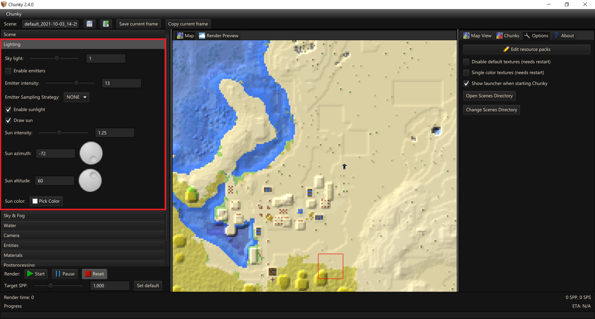

# Render Controls - Lighting

## Sky and Emitters

- `Sky Light` - This adjusts the intensity of rays hitting the sky. Higher values will have more ambient lighting, lower values will have less. The default of `1` is a good balance. Reflections can appear blown out if set too high.

- `Enable emitters` - Enables emitters such as torches, glowstone, etc.. When disabled, they are treated like normal, diffuse blocks, and will not light up the scene. When enabled, they may initially produce noise due to path tracing.

- `Emitter intensity` - The emitter intensity multiplier. Higher values will result in brighter emitters. The default of `13` is a good balance. This is compounded with each materials `Emittance` value.

- `Emitter Sampling Strategy (ESS)` - This is a powerful setting that helps decrease emitter noise at the cost of more processing power per sample. At each vertex of the ray traced path, a random (if `ONE` is selected) or all emitters (if `ALL` is selected) are sampled within a certain distance. The world must be reloaded if this is enabled when it was previously disabled.

<!-- TODO - Add links to ESS description -->

## Sunlight

- `Enable sunlight` - This setting enables / disables the contribution of sunlight. In indoor renders, this may be safely disabled to increase performance especially if rendering underground.

- `Draw sun` - This setting controls drawing the sun on the skybox.

- `Sun intensity` - The sun intensity multiplier. Higher values will result in a brighter sun and a greater contribution of sunlight. The default of `1.25` is a good balance.

- `Sun azimuth` - The angle of the sun from the north.

- `Sun altitude` -  The angle of the sun from the horizon.

- `Sun color` - The color of sunlight. Default is `pure white`.

--8<-- "includes/abbreviations.md"
