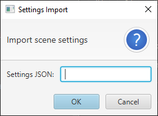

# Render Controls - Scene

---

## General

- `Scene(name)` - Input field for the current scene's name (Press enter to apply).

- `Save scene` - Saves current scene.

- `Load scene` - Opens the `Select 3D Scene` dialog.

- `Save current frame` - Saves the current frame of the Render based upon `Output mode` set under the [Advanced Tab](../advanced).

- `Copy current frame` - Copies the current frame of the render to the clipboard based upon `Output mode` set under the [Advanced Tab](../advanced).

---

- `Start` - Start / Resume render

- `Pause` - Pause current render; current sample must finish before Chunky can pause.

- `Reset` - Reset render back to 0 samples/preview.

- `Target SPP` - Controls target SPP. Can be altered on the go.

---

- `Render time` - Duration of the current render.

- `Progress` - Visual progress bar of the current render progress.

- `SPP`- Samples Per Pixel is one of the defining factors to render quality.

- `SPS` - An averaged measure of the Samples Per Second. Should note that for a 1920x1080 image there are around 2.07 million, or mega, pixels and all of these need to be sampled before SPP is incremented.

- `ETA` - Rough estimate for render completion based on SPS.

---

### Select 3D Scene

Provides a list of all detected scenes in the Scenes directory.

- `Delete` - Deletes the currently selected scene (with a confirmation prompt).

- `Export` - Exports the currently selected scene as a .zip file to a custom location.

- `Cancel` - Closes the `Select 3D Scene` dialog

- `Load selected scene` - Load the scene you have selected; Can also double-click on a scene to load it.

---

## Scene tab

### Scene and chunks

- `Open scene directory` - Opens current scenes' directory on disk. It is `~/.chunky/scenes` by default.

- `Export settings` - This allows you to export settings to a copyable JSON. You can individually choose which settings to export.

	

- `Import settings` - This allows you to import settings generated by `Export settings`.

	

- `Restore default settings` - Reset all scene settings to the default.

`Load selected chunks` - Load the chunks selected in the Map view into Chunky. Once clicked, this will load each chunk of the Minecraft world (which may take a while)! After this process completes, you may begin rendering.

`Reload chunks` - Re-load the currently selected chunks. If working with a loaded scene, ensure the current selected world is the same as the world used to create the scene.

---

### Render settings

- `Canvas size` - This is the resolution at which to render at. The drop down has a few presets. (Width x Height)

- `Set default` - Sets current canvas size as default.

- `x0.5`, `x1.5`, `x2` - Modifies each axis of the canvas by the amount. ie Wx0.5, Hx0.5

- `Load players` - If this checkbox is checked, player models are loaded when loading a world. Should be noted that deselecting this option does not unload players that have already been loaded; these need to be manually removed via the Entities tab.

- `Enable biome colors` - This checkbox controls biome tinting of natural blocks like grass or leaves.

- `Save dump once every X` - This checkbox controls if Chunky will automatically save the scene and render 
  periodically while rendering. This is not instant and does take time to save, so it is recommended to not save too frequently.

- `Save snapshot for each dump` - This checkbox controls if Chunky will automatically generate a snapshot and
save it when the dump is saved when rendering.

- `Y min clip` - This controls the minimum loaded level inclusively. For example if it is set to 0, all blocks at and above `y=0` are loaded factoring `Y max clip`.

- `Y max clip` - This controls the maximum loaded level inclusively. For example if it is set to 255, all blocks at and below `y=255` are loaded factoring `Y min clip`.

--8<-- "includes/abbreviations.md"
